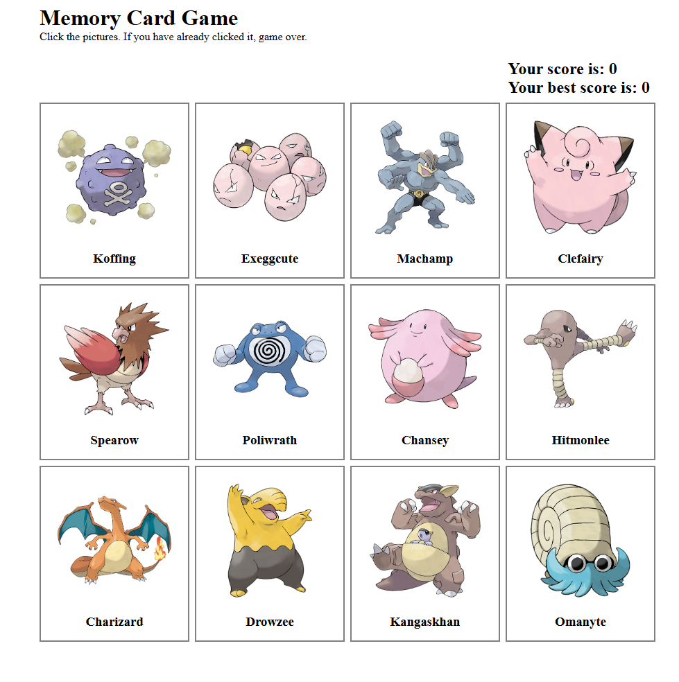

# Memory Card Game

A Pokemon-themed memory card game built with React. Click a card to score a point — click the same one twice and it's game over. Clear the whole board and a fresh set of Pokemon loads so the game keeps going.

[Play the game here](https://memory-card-game-lozukka.netlify.app/)

## Features

- Score tracking: current score and session best score, side by side
- Shuffle on click: the board reshuffles after every correct click, so card positions never stay predictable
- Continuous play: clearing all cards in a round loads a brand new, randomized set of Pokemon rather than ending the game
- Game over / play again: clicking a previously-clicked card ends the round; a "Play again" button resets the board
- Live Pokemon data: card images and names are fetched from PokeAPI on load

## Built with

- React
- Vite
- CSS
- PokeAPI
- Netlify (deployment)
- Claude AI

## What I learned

This project was part of The Odin Project curriculum. Here are the key things I learned along the way:

### useEffect is for syncing with the outside world

Fetching Pokemon data on mount belongs in a useEffect with an empty dependency array — that's a genuine "synchronize with an external system" case.

### Functional state updates when the new value depends on the old one

setScore(prev => prev + 1) instead of setScore(score + 1). This avoids stale-closure bugs where a state update reads an outdated value if multiple updates happen close together — came up with score, clicked-card tracking, and the shuffled card list.

### Sets need a new reference to trigger a re-render

Tracking which cards have been clicked with a Set meant remembering that React needs a new Set object to detect a change — mutating the existing one in place (clickedIds.add(id)) doesn't reliably trigger a re-render. The fix: new Set(prev).add(id).

### Reading state immediately after setting it gives you the old value

Inside a handler, clickedIds still refers to state from before that render — setClickedIds schedules an update, it doesn't change the variable synchronously. When a decision in the same function needed the new size (to detect a cleared board), I had to compute that value myself rather than reading clickedIds.size right after calling the setter.

### The Fisher-Yates shuffle

Fisher-Yates — iterating from the last index, swapping each element with one at a random earlier-or-equal index.

### Don't mutate shared state outside a function

An early version of the random-id generator pushed onto an array declared outside the fetch function, so every call added more ids on top of whatever was already there instead of starting fresh. The fix was building a new array inside the function on every call, rather than mutating a shared one from outside.

### React Strict Mode double-invokes effects on purpose

In development, mount effects run twice deliberately, to surface bugs where an effect isn't safe to run more than once. It's how the array-mutation bug above became visible, and also caused a visible "double render" once fetches started returning different random data each time. Fixed with a cleanup flag inside the effect that ignores a stale fetch result if the effect re-runs before the first one resolves.

### Unique random values with a Set

Generating random Pokemon ids independently could produce duplicates. Looping until a Set (which silently ignores repeat values) reaches the target size guarantees a set of distinct ids without extra duplicate-checking logic.

## Next up:

Clickable divs need keyboard and ARIA support

## Acknowledgements

Built as part of the React course on The Odin Project.

## How I used AI

I used Claude AI throughout this project. It helped me understand theory and explained concepts I was encountering for the first time — including debugging real errors (stale state, Strict Mode double-invocation, a Set-mutation bug) rather than just writing code for me. It reviewed my code and gave feedback on how to improve it to a more professional and accessible level. Claude also generated the initial draft of this README based on our conversations during the project.
